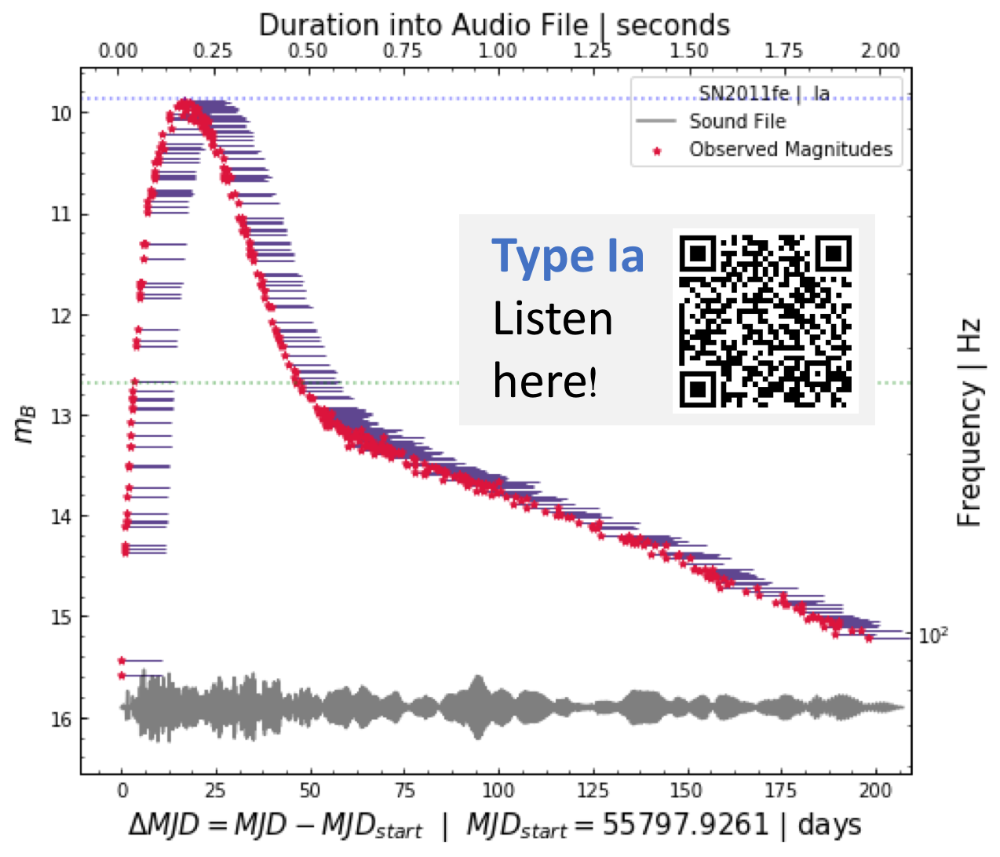
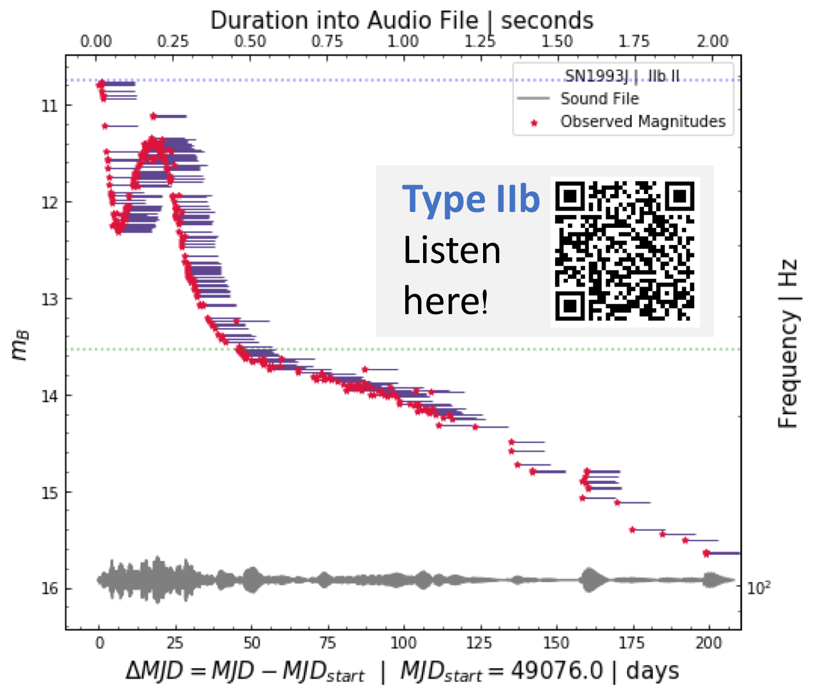
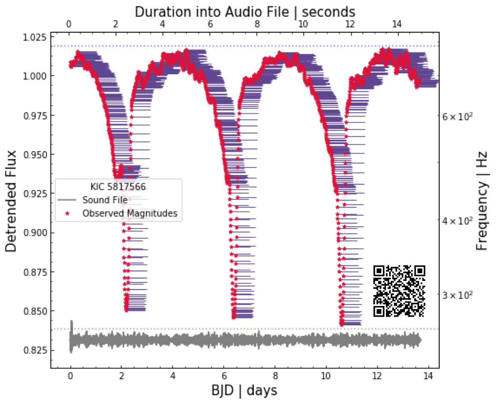
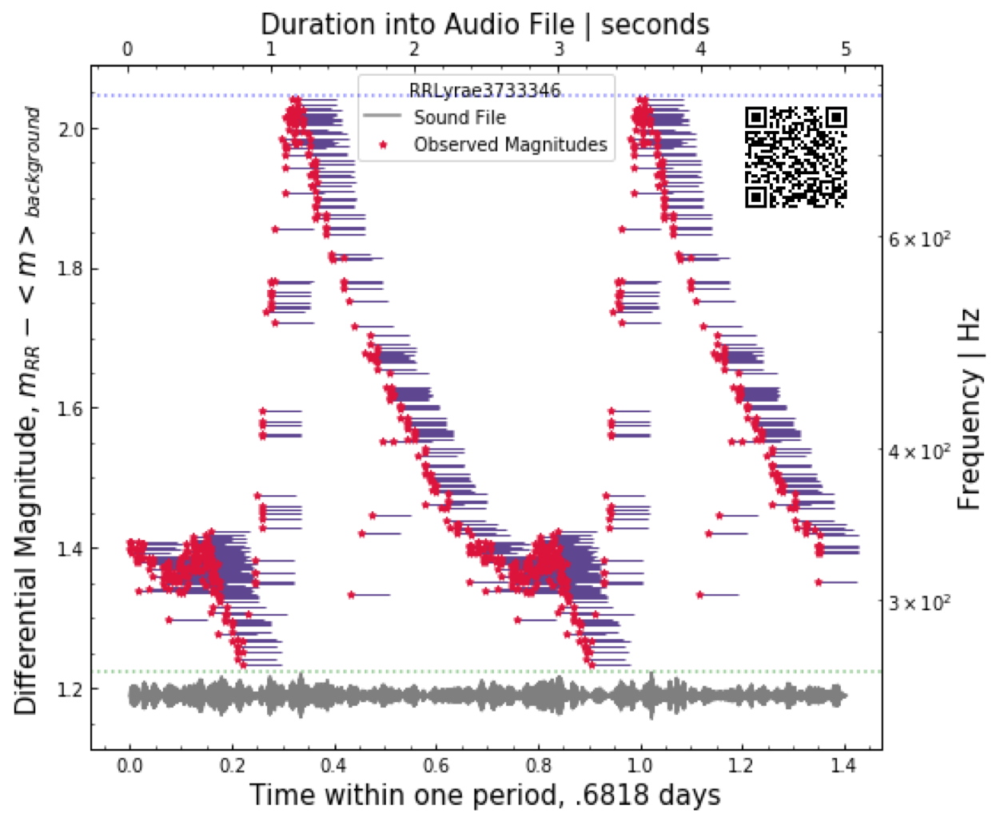

# Introduction

`Sonipy` moves beyond visual analyses by sonifying scatter-plot data, producing audio files that depict variations in y as perceptually uniform changes in pitch. Short tones - called blips - are sounded in time at intervals corresponding to x values. We built this code to open up science to participants who are visually impaired, creating scientifically useful and distinguishable sonifications of scatterplot data.

## Understanding pitch

The cent is a logarithmic unit of measure for pitch intervals where $n \approx 3986\log(b/a)$ defines the number of cents between the pitch frequencies a and b.

## Human Pitch Sensitivity

The average person is capable of discerning independent subsequent pitches with a difference of ~10 cents [@Kollmeier:2008]. The human ear is most sensitive to frequencies between ~500-4000 Hz, similar to the range of a standard piano.

With these parameters, xy scatterplot data can be translated into audio files that map y values to specific pitch frequencies, with the minimum discernible $\Delta y$ corresponding to a 10 cent pitch difference.

# The Case for Sonification: Why sonify lightcurves?

Thanks to the nature of human hearing, we can audibly discern subsequent pitch differences of 10 cents. On a y scale ranging from 0 to 10, that corresponds to hearing variations as small as $\Delta y ~ 0.03$. This simultaneous depth and range makes pitch-varied audio an incredibly powerful and accessible tool for understanding nuances in data. Through our sonification efforts of astronomical data we have found that listeners can discern differences in the brightness, duration, and period of time-domain variations when the changes in brightness are expressed as changes in pitch.

This approach also opens up science and citizen science to participants who are visually impaired, and empowers blind and visually impaired (BVI) individuals to explore their own data.

# Our Sonification Technique

As seen in Figure \autoref{fig:method}, we built our technique so that each xy data point has a corresponding short tone called a blip. The y value of a given data point corresponds to the pitch of its blip, while the x value corresponds to the placement of the blip in time. More sampled x values have a great blip density in time, and as y value increases or decreases, the tone's pitch gets higher or lower, respectively.

![Each data point corresponds to a short tone or \"blip\" in the sound file. Here the x and y values of a sine function with some noise are shown in black. The x value of a given data point determines the placement of the tone in time. The y value determines the tone's pitch. Beside each data point, we've placed a visualization of its blip, shown in color. This blip trail, with a length corresponding to the duration of the blip, shows the variation of the amplitude of the pitch at its frequency. Note that as the values get higher, the corresponding frequency of the blip increases greatly indicating a higher pitch. All of these blips are combined in time to create the sound file.\label{fig:method}](./images/Method1.png)

## Y Values: Pitch

The y value of a given data point determines the tone's pitch. A complete well-defined y frequency scale has the following parameters:

1.  A minimum frequency $f_{min}$ and its corresponding minimum y value $y_{min}$
2.  A maximum frequency $f_{max}$ and its corresponding maximum y value $y_{max}$
3.  A change in pitch (measured in cents) over change in y value parameter $\frac{dc}{dy}$

Fundamentally these values must be related via the following equation.

$$f_{min} = \frac{f_{max}}{2^{\frac{dc}{dy} [y_{max} - y_{min}] ~/~ 1200}}$$

We then relate any given y value to its corresponding frequency $f$ via the following relationship.

$$f = \frac{f_{max}}{2^{\frac{dc}{dy} [y_{max} - y] ~/~ 1200}}$$

Our code accepts either a maximum frequency and cent scale slope parameter or a maximum and minimum frequency to create a given frequency scale.

## X Values: Placement of Tones in Time

The x value determines the placement of the tone in time. A complete well-defined x time scale has the following parameters:

1.  A minimum x value $x_{min}$
2.  A maximum x value $x_{max}$
3.  A total time of the sound file $t_{total}$
4.  A change in time (measured in seconds) over change in x value parameter $\frac{dt}{dx}$

$$t = \frac{dt}{dx} [x - x_{min}]$$

Our code accepts a total time, a smallest time difference between subsequent points, a largest time difference between subsequent points, or a value for the $\frac{dt}{dx}$ parameter to create the time scale.

# Why this method?

Each datapoint corresponds to a tone blip at a frequency specified by its y value and a time specified by its x value. As the sound file plays, it scans the plot left to right, with higher y datapoints causing higher-pitched blips and vice versa.

Our method is tailored to the capabilities of the human ear and audio equipment. It is flexible, applies to a broad variety of data inputs, is fast to generate, and offers a unique means of classifying data.

We avoid methods that match changes in y to decibels, because human perception of loudness is inconsistent across users and not a perceptually uniform space. As our method is tailored to a science case, a linear increase in y corresponds to a perceptually uniform and linear increase in perceived pitch.

# The Code

The user has the power to adjust the frequency scale, the time length of the blips, and the duration of the sound file.

**Frequency scale:** Frequency is set by one of the following: a frequency minimum and maximum, or a frequency maximum and a cents / y value scale value. All frequency parameters are entered inside the frequency\_args parameter, as seen below.

**Blip length:** The time length of the blips in seconds can also be set. By default this is set to 0.5 seconds.

**Sound file duration:** Duration is set by a total time, a duration scale (in seconds / x value), or by choosing the length of minimum or maximum time difference between datapoints. Time parameters are entered simply by defining a duration\_scale (in seconds per x value). Or alternately by passing a duration\_args dictionary with some total time, smallest delta time between points or max delta time between points, as seen in the code below.

We advise a frequency scale set between middle C (C4) and four times the frequency of C4, a typical blip length of 0.5 seconds, and a total sound file duration between 1 and 3 seconds (longer sound files, played subsequently, are difficult for listeners to directly compare). Most humans can discern ~10 cents difference in pitch. Keep this in mind when defining a your cents\_per\_value parameter value for $\frac{dc}{dy}$. Furthermore, we recommend creating a test linear sound file to be sure all your chosen parameters work well with your headphones and hearing.

```python
from sonify import *

C4 = 261.6 # Hz
frequency_args = {
  'frequency_min' : C4,
  'frequency_max' : C4*4
  # 'cents_per_value' : -680,
  # 'value_min' : 0,
  # 'value_max' : 1,
}

duration_args = {
  'time_total' : 2,
  # 'time_min' : None,
  # 'time_max' : None,
}
duration_scale = None

SN = SonifyTool(values=x, durations=y,
                frequency_args = frequency_args,
                duration_args = duration_args,
                # duration_scale = duration_scale,
                length=0.5)
SN.SaveTone()
```

# Our Astronomy Case Study

## Citizen Science - Supernova Lightcurves

This code was developed as part of TransientZoo, a citizen science program that will allow participants, including BVI individuals, to classify supernova lightcurves using sound [@Patton:2019]. In astronomy, lightcurves depict variations in brightness of a specific astrophysical object as a function of time. The shape of these lightcurves are different depending upon the nature of the star or object creating the bright supernova explosion.





Figure \autoref{fig:Ia} and \autoref{fig:IIb} are two examples of successfully sonified audio light curves, for a Type IIb and Type Ia supernovae. We find that linear and plateau supernova light curves can be audibly differentiated. This approach offers a new tool for citizen science lightcurve classification.

## Other Variable Objects in Astronomy

We've also explored the sonification of other time-domain data, which will eventually help TransientZoo expand into LightcurveZoo. Figures \autoref{fig:EB} and \autoref{fig:RRLyrae} show examples of an eclipsing binary from Kepler's catalogue and an RR Lyrae from the author's own telescope observations. LightcurveZoo will ultimately include a collection of transients: supernovae, binaries, and variable stars.





# Acknowledgements

Special thanks to Dr. Chris Laws and Manastash Ridge Observatory for acquisition of some of our example observations, and to Dr. Christi Miller from the Department of Speech and Hearing Sciences at the University of Washington for her consultation on the topic of human pitch perception. This work was supported by NSF grant AST 1714285 awarded to E.M.L.

# References
